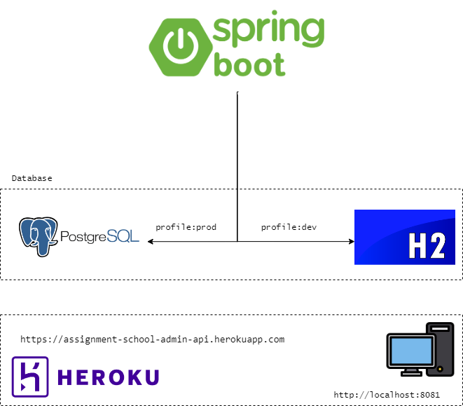
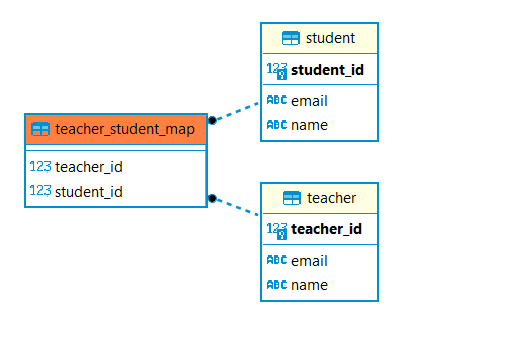

# Assignment for technical assessment [(Requirement)](https://gist.github.com/ongbt/b06720e106a4a02ddf33de7bc5537e19#backend-api-asessment)

### Introduction

The School Admin project is an API service that register teachers to students. It provides a secure and easy-to-use platform for teachers to view their list of students.

### Features
The School Administration API provides the following features:

- Student & teacher registration
- Register single/multiple student to teacher
- De-register single student from teacher
- View all teacher with registered students

### Technology Stack
This application is built using the following technology stack:

- Java 11
- Spring Boot Framework
- Maven
- H2 Database (for local development environment)
- PostgreSQL (for production environment)  

The Spring Boot Framework provides a robust and scalable platform for building web applications. H2 Database is used for local development, providing an in-memory database for quick and easy testing. For production, the project is configured to use PostgreSQL, a powerful and reliable relational database management system.  

By utilizing these technologies, the project is able to deliver a fast, reliable, and secure web application for managing assignments and students.  

### Architecture diagram illustration

### DB diagram illustration

### Hostname

- dev profile: `http://localhost:8081`  
- prod profile: `https://assignment-school-admin-api.herokuapp.com/`  

### Software requirements

1. Java 11
2. Maven
3. Git

### How to Run

To run the School Admin API, follow these steps:

- Make sure you have fulfilled the above software requirements.

- Clone this repository to your local machine by running the below command in terminal:

       git clone https://github.com/norulshahlam/assignment-school-admin-api.git

- Navigate to the project directory in the terminal/command prompt.

- Build the app by running the following command:

       mvn clean install package

- The build application will be stored in /target folder. Now run the following command to run the app:  

       java -jar target/assignment-school-admin-api-0.0.1-SNAPSHOT.jar

- Now your application has started. By default, dev profile is selected and there is no preloaded data. So you might need to add the data first.

- You can test the API using swagger by opening any browser and use the following url:

       {hostname}/swagger-ui/index.html#/

- Alternatively, you can use postman to manually test the endpoints. Download the postman  collection [**HERE**](/src/main/resources/assigment-school-admin-api.postman_collection.json), and use Postman to import this collection. Now you can test the endpoints using Postman. Make sure you have postman installed. You can click [**HERE**](https://www.postman.com/downloads/) to download if you dont't have one.

- As this is secured API, you have to enter your credentials. A prompt will be shown when you go to the swagger endpoint. If you are using Postman, add this credentials under basic auth:

       username: admin
       password: password

- You may skip all steps above if the production hostname is available, to access Swagger (don't forget credentials!).

        {hostname}/swagger-ui/index.html#/

- For any issues, email me at norulshahlam@gmail.com or whatsapp me at +6592212152

### Conclusion

Congratulations, you have successfully compiled and run the app! With this application, users can easily manage data of teachers and students.